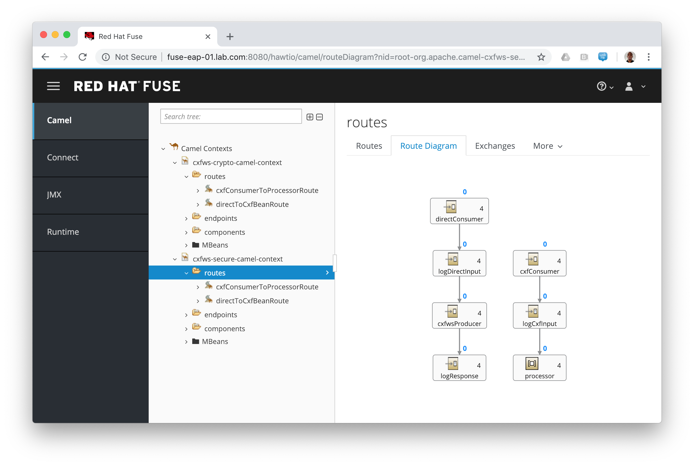

## Red Hat Fuse on EAP Examples

This directory contains a suite of useful modules to demonstrate various features of the Red Hat Fuse on EAP.
Their aim is to provide small, specific and working examples that can be used for reference in your own projects.
* [camel-cxf-jaxws-crypto](camel-cxf-jaxws-crypto)
* [camel-cxf-jaxws-secure](camel-cxf-jaxws-secure)

### :raised_hands: NOTE :raised_hands:
All the examples are based on the [_The WildFly-Camel Examples_](https://github.com/wildfly-extras/wildfly-camel-examples.git).

### Prerequisites

The examples require a running application server with Red Hat Fuse on EAP installed. Refer to the Red Hat Fuse on EAP installation documentation for how to do this.

### :warning: ATTENTION :warning:

You have to adapt the `wildfly-maven-plugin according to your _JBoss EAP_ environment

### Running Examples

Each example aims to be interactive to help you learn how to get started with the Red Hat Fuse on EAP. Each example
can be accessed by changing into the example source directory, building the project `mvn clean install` and then deploying
to a running application server `mvn install -Pdeploy`.

Examples can be undeployed from a running application server by running `mvn clean -Pdeploy`.

